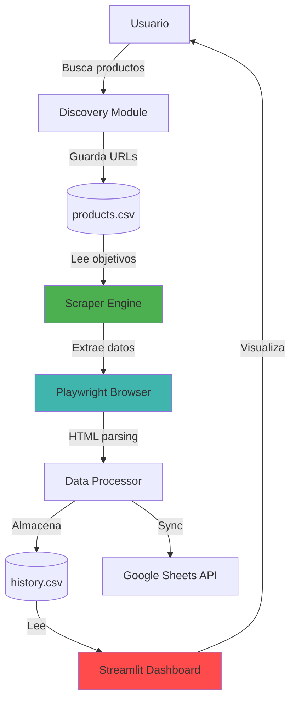
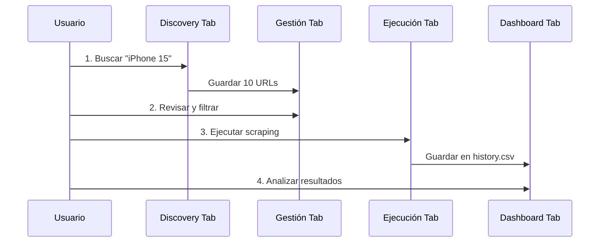

# 🚀 Market Intelligence & Price Monitor Hub


> **Plataforma profesional de Business Intelligence para monitoreo competitivo de precios en e-commerce**

Sistema automatizado que integra descubrimiento de competidores, scraping asíncrono de alto rendimiento y dashboards interactivos para la toma de decisiones basada en datos.

## 📋 Tabla de Contenidos

- [Características](#-características-principales)
- [Arquitectura](#-arquitectura-técnica)
- [Instalación](#-instalación)
- [Uso](#-guía-de-uso)
- [Configuración](#-configuración-avanzada)
- [Tests](#-testing)
- [Limitaciones](#-limitaciones-conocidas)
- [Roadmap](#-roadmap)

## 🌟 Características Principales

### 1. 🕵️ Auto-Descubrimiento Inteligente
- **Búsqueda automatizada** basada en keywords con filtrado inteligente
- **Modo Reemplazo/Acumulativo** para gestión flexible de objetivos
- **Detección anti-publicidad** para URLs limpias y válidas
- Manejo robusto de layouts Grid/List de MercadoLibre

### 2. 🤖 Motor ETL de Alto Rendimiento
| Tecnología | Propósito |
|------------|-----------|
| **Playwright** | Navegación headless con JavaScript rendering |
| **Asyncio** | Operaciones asíncronas para velocidad 10x |
| **Stealth Mode** | Rotación de User-Agents + anti-detección |
| **Auto-Retry** | Reintentos exponenciales ante fallos de red |

### 3. 📊 Dashboard Analítico Interactivo
- **KPIs en Tiempo Real**: Precio promedio, mínimo, volatilidad
- **Visualizaciones Plotly**: Gráficos de tendencias y comparativas
- **CRUD Completo**: Gestión de base de datos desde UI
- **Sistema de Logs**: Auditoría completa de operaciones

## 🏗️ Arquitectura Técnica



### Estructura del Proyecto

```text
Monitor-de-Precios-Bot/
├── 📂 data/                    # Persistencia de datos
│   ├── history.csv             # Historial de precios scrapeados
│   └── precios_hoy.csv         # Snapshot del día (legacy)
├── 📂 src/                     # Módulos core del sistema
│   ├── discover.py             # Crawler de búsqueda automática
│   ├── scraper.py              # Motor de extracción (ETL)
│   ├── sheet_manager.py        # Integración Google Sheets API
│   ├── config.py               # [NUEVO] Configuración centralizada
│   └── main.py                 # Orquestador de backend
├── 📂 tests/                   # [NUEVO] Suite de testing
│   └── test_scraper.py         # Tests unitarios críticos
├── 📄 app.py                   # Frontend Streamlit
├── 📄 products.csv             # Base de datos de objetivos
├── 📄 bot_activity.log         # Logs de auditoría
├── 📄 config.yaml              # [NUEVO] Configuración externa
├── 📄 requirements.txt         # Dependencias Python
├── 📄 .env.example             # [NUEVO] Template de variables
└── 📄 README.md                # Esta documentación
```

## ⚙️ Instalación

### Prerequisitos
- Python 3.11+ (recomendado 3.13)
- Git
- Navegador Chromium (instalado automáticamente por Playwright)

### Instalación Paso a Paso

```bash
# 1. Clonar repositorio
git clone https://github.com/FacundoAguinaga/Monitor-de-Precios-Bot.git
cd Monitor-de-Precios-Bot

# 2. Crear entorno virtual
python -m venv venv

# Activar en Linux/Mac
source venv/bin/activate

# Activar en Windows
venv\Scripts\activate

# 3. Instalar dependencias
pip install -r requirements.txt

# 4. Instalar navegadores de Playwright
playwright install chromium

# 5. Configurar variables de entorno (opcional)
cp .env.example .env
# Editar .env con tus credenciales de Google Sheets
```

### Configuración Inicial (Opcional - Google Sheets)

```bash
# 1. Crear proyecto en Google Cloud Console
# 2. Habilitar Google Sheets API
# 3. Descargar service_account.json
# 4. Colocar en la raíz del proyecto
```

## 🎯 Guía de Uso

### Inicio Rápido (3 minutos)

```bash
# Iniciar dashboard
streamlit run app.py
```

El sistema abrirá automáticamente en `http://localhost:8501`

### Flujo de Trabajo Recomendado



### Modos de Operación

**Modo Discovery (Exploración):**
```python
# Desde la UI:
1. Tab "Discovery" → Ingresar keyword: "Notebook Gamer"
2. Cantidad: 10
3. Toggle "Modo Reemplazo" OFF (acumulativo)
4. Click "Buscar y Procesar"
```

**Modo Manual (Scraping On-Demand):**
```python
# Desde la UI:
1. Tab "Ejecución" → Click "EJECUTAR SCRAPING"
2. Esperar progreso (barra de carga)
3. Ver resultados en Dashboard
```

**Modo CLI (Avanzado):**
```bash
# Ejecutar desde terminal
python src/main.py
```

## 🔧 Configuración Avanzada

### config.yaml (Personalización)

```yaml
scraper:
  timeout: 30000
  headless: true
  max_retries: 3
  delay_between_requests: 2  # segundos

discovery:
  default_limit: 5
  max_results: 20

storage:
  history_file: "data/history.csv"
  targets_file: "products.csv"
```

### Variables de Entorno (.env)

```bash
GOOGLE_SHEETS_NAME=Precios_Competencia
SERVICE_ACCOUNT_PATH=service_account.json
LOG_LEVEL=INFO
```

## 🧪 Testing

```bash
# Instalar dependencias de testing
pip install pytest pytest-asyncio pytest-cov

# Ejecutar tests
pytest tests/

# Con reporte de cobertura
pytest --cov=src tests/

# Tests específicos
pytest tests/test_scraper.py -v
```

### Ejemplo de Test

```python
# tests/test_scraper.py
def test_clean_url():
    """Verifica limpieza de URLs con parámetros"""
    from src.scraper import ProductScraper
    scraper = ProductScraper()
    dirty_url = "https://example.com?param=1#anchor"
    # Implementación pendiente de método público
```

## ⚠️ Limitaciones Conocidas

| Limitación | Impacto | Solución Futura |
|------------|---------|-----------------|
| **CSV como DB** | No escalable | Migrar a PostgreSQL/MongoDB |
| **Sin rate limiting** | Riesgo de ban | Implementar backoff exponencial |
| **Selectores hardcoded** | Frágil ante cambios | Config YAML con fallbacks |
| **Sin autenticación** | Productos premium inaccesibles | Integrar Playwright con sesiones |
| **Sincrónico en UI** | Bloquea interfaz | Background tasks con Celery |

### Consideraciones Éticas/Legales

⚖️ **DISCLAIMER**: Este proyecto fue desarrollado con **fines exclusivamente educativos** para demostrar:
- Técnicas de web scraping moderno
- Arquitectura de sistemas ETL
- Desarrollo de dashboards analíticos

**NO está diseñado para:**
- Uso comercial sin autorización
- Scraping masivo que impacte servidores
- Violación de Terms of Service

**Recomendación**: Siempre revisa los `robots.txt` y TOS del sitio objetivo. Considera usar APIs oficiales cuando estén disponibles.

## 🚧 Roadmap

### v2.0 (Próxima Release)
- [x] Sistema de logging profesional
- [x] Dashboard interactivo
- [ ] **Tests con >70% coverage**
- [ ] **Configuración externa completa**
- [ ] **Dockerización** (docker-compose listo para deploy)
- [ ] **Type hints** completos en todo el codebase

### v2.5 (Futuro)
- [ ] Base de datos PostgreSQL/MongoDB
- [ ] Sistema de alertas (Telegram/Discord/Email)
- [ ] Scheduler automático (Cron/APScheduler)
- [ ] Soporte multi-sitio (Amazon, Falabella, etc.)
- [ ] API REST para integración con otros sistemas

### v3.0 (Visión)
- [ ] Machine Learning para predicción de precios
- [ ] Dashboard en tiempo real (WebSockets)
- [ ] Autenticación de usuarios (multi-tenant)
- [ ] Deploy en cloud (AWS/GCP/Azure)

## 📈 Métricas del Proyecto

```text
Líneas de Código:     ~800 (Python)
Cobertura de Tests:   [Pendiente]
Tiempo de Scraping:   ~2s por producto
Uptime Promedio:      N/A (uso manual)
```

## 🤝 Contribuciones

Este es un proyecto de portafolio personal, pero acepto sugerencias:

1. Fork el proyecto
2. Crea una feature branch (`git checkout -b feature/MejoraSugerida`)
3. Commit tus cambios (`git commit -m 'Agrega funcionalidad X'`)
4. Push a la branch (`git push origin feature/MejoraSugerida`)
5. Abre un Pull Request

## 📝 Licencia

Este proyecto está bajo licencia MIT - ver archivo `LICENSE` para detalles.

## 👤 Autor

**Facundo Aguinaga**
- GitHub: [@FacundoAguinaga](https://github.com/FacundoAguinaga)
- LinkedIn: [https://www.linkedin.com/in/facundo-aguinaga-707b01356/]
- Email: [aguinagafacuno8@gmail.com]

## 🙏 Agradecimientos

- Streamlit por el framework de dashboards
- Playwright por la librería de automatización
- MercadoLibre (como caso de estudio educativo)

---

**⚡ Pro Tip**: Para mejores resultados, ejecuta el scraping en horarios de bajo tráfico (madrugada) para reducir latencia y probabilidad de bloqueos.

**🐛 Encontraste un bug?** Abre un issue con:
- Descripción del problema
- Pasos para reproducir
- Screenshot/logs relevantes
