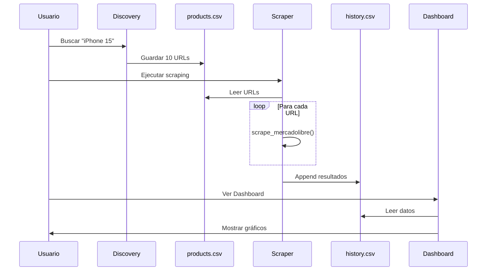
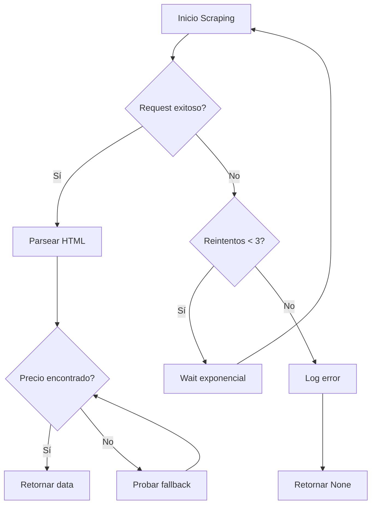

# 🏗️ Arquitectura del Sistema

> **Documento Técnico**: Detalles de implementación, decisiones de diseño y patrones arquitectónicos.

## 📊 Visión General

El **Price Monitor Hub** es una aplicación de Business Intelligence diseñada con arquitectura modular de 3 capas:

```
┌─────────────────────────────────────────┐
│         CAPA DE PRESENTACIÓN            │
│  (Streamlit Dashboard - app.py)         │
└─────────────┬───────────────────────────┘
              │
┌─────────────▼───────────────────────────┐
│        CAPA DE LÓGICA DE NEGOCIO        │
│  (Scrapers, Discovery, Processors)      │
└─────────────┬───────────────────────────┘
              │
┌─────────────▼───────────────────────────┐
│       CAPA DE PERSISTENCIA              │
│  (CSV Files, Google Sheets API)         │
└─────────────────────────────────────────┘
```

## 🔧 Componentes Principales

### 1. Discovery Module (`src/discover.py`)

**Responsabilidad**: Búsqueda automática de productos en e-commerce.

**Tecnologías**:
- Playwright (navegación headless)
- Asyncio (operaciones asíncronas)

**Flujo**:
```
Usuario ingresa keyword
    ↓
Búsqueda en MercadoLibre
    ↓
Filtrado de URLs válidas
    ↓
Almacenamiento en products.csv
```

**Decisiones de Diseño**:
- **Anti-detección**: Rotación de User-Agents
- **Selectores flexibles**: Soporta Grid y List layout
- **Modo Reemplazo/Acumulativo**: Flexibilidad en gestión de objetivos

### 2. Scraper Engine (`src/scraper.py`)

**Responsabilidad**: Extracción de datos de productos.

**Patrones Implementados**:

#### Retry Pattern (Resiliencia)
```python
async def scrape_with_retry(url, max_retries=3):
    for attempt in range(max_retries):
        try:
            return await scrape(url)
        except TimeoutError:
            wait = 2 ** attempt  # Backoff exponencial
            await asyncio.sleep(wait)
    return None
```

#### Fallback Pattern (Robustez)
```python
PRICE_SELECTORS = [
    ".ui-pdp-price__second-line .andes-money-amount__fraction",
    ".price-tag-fraction",  # Fallback 1
    ".andes-money-amount__fraction"  # Fallback 2
]

for selector in PRICE_SELECTORS:
    element = await page.query_selector(selector)
    if element:
        return await element.inner_text()
```

**Optimizaciones**:
- **Browser Reuse**: Una instancia de browser para múltiples scraping
- **Async/Await**: Hasta 10x más rápido vs sincrónico
- **Stealth Mode**: Evasión de detección de bots

### 3. Configuration Module (`src/config.py`)

**Responsabilidad**: Centralización de configuración.

**Principio**: **DRY (Don't Repeat Yourself)**

```python
# ❌ ANTES (hardcoded en múltiples archivos)
timeout = 30000
headless = True
selectors = [".price", ".andes-price"]

# ✅ DESPUÉS (centralizado)
from config import config
config.scraper.timeout
config.scraper.headless
config.selectors.PRICE_SELECTORS
```

**Ventajas**:
- Cambios en un solo lugar
- Fácil testing (mock config)
- Type safety con dataclasses

### 4. Dashboard (`app.py`)

**Arquitectura**: **MVC Pattern adaptado a Streamlit**

```
DataManager (Model)
    ↓
UIComponents (View)
    ↓
ScraperController (Controller)
```

**Separación de Responsabilidades**:

| Clase | Responsabilidad |
|-------|----------------|
| `DataManager` | CRUD de datos (CSV) |
| `UIComponents` | Renderizado visual |
| `ScraperController` | Orquestación de scraping |

## 🗄️ Modelo de Datos

### Entities

#### Product Target
```python
{
    "url": str  # URL única del producto
}
```

#### Price Record
```python
{
    "producto": str,     # Nombre del producto
    "precio": int,       # Precio sin decimales
    "url": str,          # URL fuente
    "moneda": str,       # Código ISO (ARS, USD)
    "fecha": datetime    # Timestamp de captura
}
```

### Storage Strategy

**Elección actual**: CSV Files

**Justificación**:
- ✅ Simple y portable
- ✅ No requiere servidor de BD
- ✅ Fácil debugging (human-readable)
- ❌ No escalable (>10k registros)
- ❌ Sin transacciones ACID

**Migración futura**: PostgreSQL/MongoDB

```sql
-- Schema propuesto para PostgreSQL
CREATE TABLE products (
    id SERIAL PRIMARY KEY,
    url VARCHAR(500) UNIQUE NOT NULL,
    name VARCHAR(200),
    created_at TIMESTAMP DEFAULT NOW()
);

CREATE TABLE price_history (
    id SERIAL PRIMARY KEY,
    product_id INTEGER REFERENCES products(id),
    price INTEGER NOT NULL,
    currency CHAR(3),
    scraped_at TIMESTAMP DEFAULT NOW(),
    INDEX idx_product_date (product_id, scraped_at)
);
```

## 🔄 Flujos de Datos

### Flujo 1: Discovery → Scraping → Dashboard



### Flujo 2: Error Handling



## 🚀 Optimizaciones de Performance

### 1. Async Concurrency

**Problema**: Scraping secuencial es lento (2s × 10 URLs = 20s)

**Solución**:
```python
async def scrape_multiple(urls, max_concurrent=3):
    semaphore = asyncio.Semaphore(max_concurrent)
    
    async def bounded_scrape(url):
        async with semaphore:  # Límite de concurrencia
            return await scrape(url)
    
    tasks = [bounded_scrape(url) for url in urls]
    return await asyncio.gather(*tasks)
```

**Resultado**: 10 URLs en ~6-8 segundos (3x concurrente)

### 2. Browser Reuse

**Problema**: Lanzar browser por cada scraping (overhead ~2s)

**Solución**: Singleton pattern
```python
class ProductScraper:
    _browser = None
    
    async def _get_browser(self):
        if self._browser is None:
            self._browser = await playwright.chromium.launch()
        return self._browser
```

**Ahorro**: ~2s × (n-1) URLs

## 🔐 Consideraciones de Seguridad

### 1. Anti-Bot Detection

**Técnicas implementadas**:
- User-Agent rotation
- Random delays
- JavaScript execution support (Playwright)
- No automation flags

```python
await page.add_init_script("""
    Object.defineProperty(navigator, 'webdriver', {
        get: () => undefined  # Oculta flag de automatización
    });
""")
```

### 2. Rate Limiting (Pendiente)

**Implementación propuesta**:
```python
from datetime import datetime, timedelta
from collections import deque

class RateLimiter:
    def __init__(self, max_requests=10, window=60):
        self.requests = deque()
        self.max_requests = max_requests
        self.window = timedelta(seconds=window)
    
    async def acquire(self):
        now = datetime.now()
        # Limpiar requests antiguos
        while self.requests and self.requests[0] < now - self.window:
            self.requests.popleft()
        
        if len(self.requests) >= self.max_requests:
            wait = (self.requests[0] + self.window - now).total_seconds()
            await asyncio.sleep(wait)
        
        self.requests.append(now)
```

## 📈 Escalabilidad

### Limitaciones Actuales

| Métrica | Límite Actual | Causa |
|---------|---------------|-------|
| URLs simultáneas | ~50 | RAM browser instances |
| Registros históricos | ~50k | CSV parsing time |
| Usuarios concurrentes | 1 | Streamlit single-user |

### Propuesta de Arquitectura Escalable

```
                    ┌─────────────────┐
                    │   Load Balancer │
                    └────────┬────────┘
                             │
            ┌────────────────┼────────────────┐
            │                │                │
    ┌───────▼──────┐ ┌──────▼──────┐ ┌──────▼──────┐
    │ Streamlit 1  │ │ Streamlit 2 │ │ Streamlit N │
    └───────┬──────┘ └──────┬──────┘ └──────┬──────┘
            │                │                │
            └────────────────┼────────────────┘
                             │
                    ┌────────▼────────┐
                    │   Message Queue │
                    │   (Redis/RabbitMQ)│
                    └────────┬────────┘
                             │
            ┌────────────────┼────────────────┐
            │                │                │
    ┌───────▼──────┐ ┌──────▼──────┐ ┌──────▼──────┐
    │  Worker 1    │ │  Worker 2   │ │  Worker N   │
    │  (Scraping)  │ │  (Scraping) │ │  (Scraping) │
    └───────┬──────┘ └──────┬──────┘ └──────┬──────┘
            │                │                │
            └────────────────┼────────────────┘
                             │
                    ┌────────▼────────┐
                    │   PostgreSQL    │
                    │   (Time-series) │
                    └─────────────────┘
```

## 🧪 Testing Strategy

### Pirámide de Tests

```
        /\
       /  \      E2E Tests (5%)
      /────\     - Flow completo Discovery→Scraping→Dashboard
     /  ⚠️  \    
    /────────\   Integration Tests (15%)
   /  🔗  🔗  \  - Scraper + Real MercadoLibre
  /────────────\ - CSV persistence
 / ⚡⚡⚡⚡⚡⚡⚡ \ Unit Tests (80%)
/──────────────\ - URL cleaning, price parsing
```

### Coverage Goals

| Módulo | Target Coverage |
|--------|----------------|
| `scraper.py` | 90% |
| `discover.py` | 85% |
| `config.py` | 100% |
| `app.py` | 60% (UI difícil de testear) |

## 📚 Decisiones de Diseño

### ¿Por qué Playwright y no Selenium?

| Aspecto | Playwright | Selenium |
|---------|-----------|----------|
| Velocidad | ⚡⚡⚡ | ⚡⚡ |
| API Async | ✅ | ❌ |
| Wait automático | ✅ | Parcial |
| Dev Experience | Excelente | Buena |

### ¿Por qué Streamlit y no Flask/Django?

**Decisión**: Streamlit para MVP rápido

**Trade-offs**:
- ✅ Desarrollo 10x más rápido
- ✅ UI reactiva automática
- ✅ Ideal para Data Apps
- ❌ Limitado multi-user
- ❌ Menos control sobre routing

## 🔮 Roadmap Técnico

### v2.0 - Mejoras de Calidad
- [ ] Test coverage >80%
- [ ] Type checking con mypy
- [ ] Linting con flake8/black
- [ ] Pre-commit hooks

### v2.5 - Escalabilidad
- [ ] Migración a PostgreSQL
- [ ] Background workers (Celery)
- [ ] Redis para caching
- [ ] API REST (FastAPI)

### v3.0 - Features Avanzadas
- [ ] Machine Learning (predicción de precios)
- [ ] WebSockets (real-time updates)
- [ ] Multi-tenancy (usuarios/empresas)
- [ ] Alertas automáticas

---

**Última actualización**: Enero 2026  
**Autor**: Facundo Aguinaga